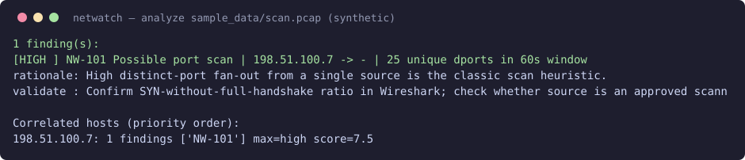
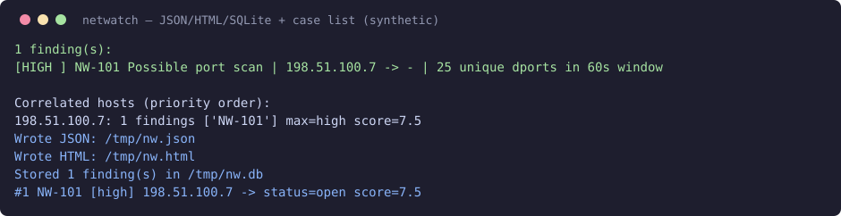

# NetWatch — Defensive Network Threat Detection & PCAP Analysis

Defensive-only heuristic detector for packet captures / lab traffic. It parses a PCAP
via `tshark`, extracts per-source features, runs 8 independent rules, scores and
correlates findings, and emits console + JSON + HTML reports with SQLite case management.

> **Scope:** test only against PCAPs, synthetic traffic, CTF/lab systems you own or
> have permission to analyze. Heuristics are investigative leads — they do **not**
> prove compromise.

## Why it exists

A portfolio complement to log-analysis tooling: this project demonstrates **network
detection engineering** — parsing, feature extraction, threshold reasoning,
false-positive handling, MITRE mapping, analyst workflow, and testing.

## Architecture

```
PCAP --[tshark JSON]--> parser.py --> features.py (normalize + per-src stats)
        --> rules.py (8 modular rules) --> analysis.py (score + correlate)
        --> report.py (console/JSON/HTML) + store.py (SQLite) <-- cli.py
config.py supplies validated thresholds.
```

```plaintext
+----------------+      +----------------+      +------------------+
| sample_data/   | ---> | parser (tshark)| ---> | features/extract |
| *.pcap (lab)   |      | stdlib+subproc |      | per-src agg      |
+----------------+      +----------------+      +--------+---------+
                                                         |
                       +---------------------------------+----------------------------------+
                       | NW-101 port scan  NW-102 discovery  NW-103 repeated  NW-104 DNS    |
                       | NW-105 HTTP recon NW-106 beaconing  NW-107 susp.port NW-108 flood |
                       +---------------------------------+----------------------------------+
                                                         |
                        +---------------+----------------+------------------+
                        | score/correlate|  report (cli/json/html) | store (sqlite) |
                        +----------------+-------------------------+----------------+
```

New rules: add a `@rule("NW-1xx", ...)` function in `netwatch/rules.py` + append to
`RULE_ORDER`. No app rewrite needed.

## Detection rules

| ID | Name | Severity | MITRE | FP notes |
|----|------|----------|-------|----------|
| NW-101 | Possible port scan | high | T1046 | approved vuln scanners, inventory |
| NW-102 | Possible host discovery sweep | medium | T1046 | monitoring, DHCP churn |
| NW-103 | Suspicious repeated connections | medium | T1110 (weak signal — confirm auth failures in app logs) | retries, polling APIs |
| NW-104 | Suspicious DNS behavior | medium | T1071.004, T1048 | prefetch, captive portals, security products |
| NW-105 | Possible HTTP reconnaissance | medium | T1595.002 | own scanners, CMS admin traffic |
| NW-106 | Possible beaconing | medium | T1071 | updaters, mail checks, keepalives, NTP |
| NW-107 | Connection to suspicious port | low | (none — contacting a port is not a technique) | legit SSH/RDP admin use |
| NW-108 | Unusual connection frequency | medium | T1499 | backups, speed tests, streaming |

MITRE mappings are *heuristically associated techniques*, not attributions — a port
fan-out only *resembles* T1046; confirm with payload/endpoint evidence.

## Installation (Arch Linux)

```bash
sudo pacman -S wireshark-cli python   # provides tshark
python -m venv .venv && source .venv/bin/activate
pip install pytest scapy              # dev/test only; runtime is stdlib + tshark
```

Runtime dependency set: **Python stdlib + tshark**. Deliberately zero runtime pip deps.

## Usage

```bash
PYTHONPATH=. python3 -m netwatch.cli analyze --pcap sample_data/scan.pcap --verbose
PYTHONPATH=. python3 -m netwatch.cli analyze --pcap sample_data/scan.pcap \
  --json-out reports/scan.json --html-out reports/scan.html --db reports/cases.db \
  --config config/default.yaml
PYTHONPATH=. python3 -m netwatch.cli list --db reports/cases.db
PYTHONPATH=. python3 -m netwatch.cli show --db reports/cases.db --id 1
PYTHONPATH=. python3 -m netwatch.cli status --db reports/cases.db --id 1 --to false_positive --note "approved scanner"
```

Exit codes: `0` ok · `2` usage/missing-file/bad-config/bad-status · `3` empty/unsupported
capture · `4` parser backend failure.

## Example output

```
$ analyze --pcap sample_data/scan.pcap
1 finding(s):
[HIGH    ] NW-101 Possible port scan | 198.51.100.7 -> - | 25 unique dports in 60s window
Correlated hosts (priority order):
  198.51.100.7: 1 findings ['NW-101'] max=high score=7.5
```

Benign capture yields: `No findings. Traffic did not cross any detection thresholds.`

## Screenshots (synthetic lab traffic)

All captures below come from the shipped synthetic PCAPs (`sample_data/`, RFC5737 TEST-NET addresses) — reproduce with `make demo` (requires `tshark`).





The full single-file HTML report from the same run is saved at [`docs/screenshots/scan.html`](docs/screenshots/scan.html) — open it in a browser (local file only). Raw JSON output follows the same shape as `reports/` artifacts.

## Sample investigation

Lab scenario `scan.pcap` (all addresses RFC 5737 TEST-NET, synthetic):
alert NW-101 → source `198.51.100.7` → dst `192.0.2.10`, TCP, 25 ports in 60 s →
timeline shows evenly spaced SYNs → related alerts: none (single rule) → open
`scan.html`, confirm SYN-no-handshake in Wireshark → disposition: escalate if source
is not an approved scanner, else `false_positive` with note.

## How I would investigate these alerts in a real SOC

network alert → source IP (asset? owned? DHCP lease? EDR present?) → destination
(expected service? internet? threat-intel match?) → protocol/port (banner, handshake
completion) → timeline (burst vs business hours vs baseline) → related alerts
(same src correlation group) → packet/application evidence (payload, DNS logs, proxy,
auth logs) → final disposition (`investigating` → `closed` or `false_positive` with note).

## Testing

```bash
python -m pytest tests/ -q
```

32 tests: parser (missing/empty/field-shape), 8 rules with positive +
negative cases, threshold boundaries, DNS windowing, window-timestamp correctness,
multi-service repetition, jitter-vs-beacon, scoring order, multi-rule
correlation, JSON/HTML reporters (incl. empty case), SQLite workflow + invalid
status, config validation (incl. YAML fallback + severity overrides), CLI error exits.

## Limitations

- Heuristics only; encrypted traffic hides HTTP/DNS content (and DoH/DoT bypasses
  DNS rules entirely); thresholds need per-environment tuning; requires `tshark`;
  no TCP reassembly/stream tracking (fragmented or multi-packet HTTP URIs can be
  missed; only the first DNS query name per packet is kept); synthetic samples are
  SYN/query-only and don't represent real adversary behavior; counts are
  packet-based, not flow-based.

## Future improvements

Per-subnet baselines, JA3/TLS features, full DNS answer ingestion, stream
reassembly, allowlist config, PDF export.

## Legal/ethical scope

Defensive security only. No malware, persistence, credential theft, exploitation,
or evasion. Analyze only traffic you own or are authorized to handle.
